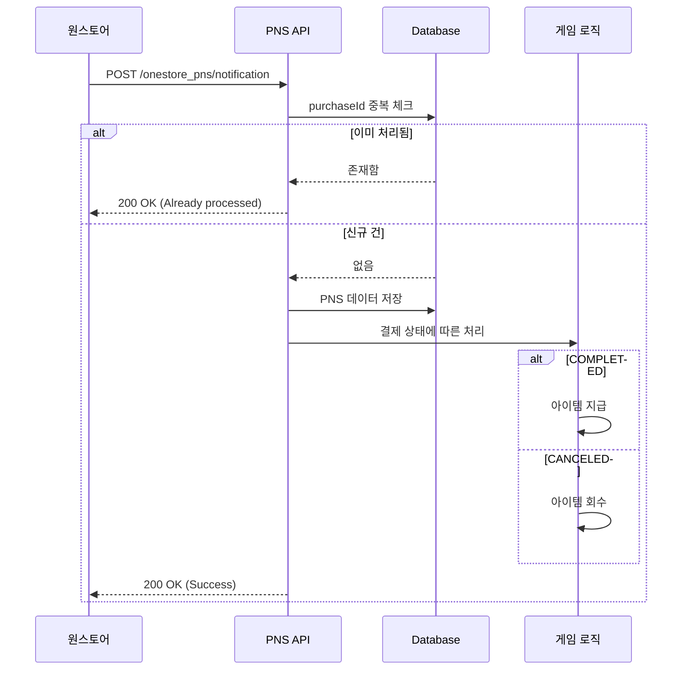

# 원스토어 PNS(Push Notification Service) 연동 가이드

## 📋 개요

원스토어 PNS는 인앱상품 결제 또는 결제취소가 발생할 때 원스토어가 개발사 서버로 알림을 전송하는 서비스입니다.

## 🎯 주요 기능

- ✅ 결제 완료 알림 수신
- ✅ 결제 취소 알림 수신
- ✅ 중복 알림 방지 (멱등성 보장)
- ✅ 원본 데이터 완전 저장
- ✅ 테스트폰 구분
- ✅ Sandbox/Commercial 환경 구분
- ✅ 원스토어/원스토어 글로벌 구분

## 📡 API 엔드포인트

```
POST /onestore_pns/notification
```

## 📦 요청 데이터 구조

### Headers
```
Content-Type: application/json
```

### Body (JSON)

```json
{
  "msgVersion": "3.1.0",
  "clientId": "0000000001",
  "productId": "0900001234",
  "messageType": "SINGLE_PAYMENT_TRANSACTION",
  "purchaseId": "SANDBOX3000000004564",
  "developerPayload": "OS_000211234",
  "purchaseTimeMillis": 1738646400000,
  "purchaseState": "COMPLETED",
  "price": "10000",
  "priceCurrencyCode": "KRW",
  "productName": "GOLD100(+20)",
  "paymentTypeList": [
    {
      "paymentMethod": "DCB",
      "amount": "3000"
    },
    {
      "paymentMethod": "ONESTORECASH",
      "amount": "7000"
    }
  ],
  "billingKey": "...",
  "isTestMdn": true,
  "purchaseToken": "TOKEN...",
  "environment": "SANDBOX",
  "marketCode": "MKT_ONE",
  "signature": "SIGNATURE..."
}
```

### 주요 필드 설명

| 필드 | 타입 | 설명 |
|------|------|------|
| `msgVersion` | String | 메시지 버전 (3.1.0: 상용, 3.1.0D: 개발) |
| `clientId` | String | 앱의 클라이언트 ID |
| `productId` | String | 인앱상품의 상품 ID |
| `purchaseId` | String | **구매 ID (고유키)** |
| `purchaseState` | String | **COMPLETED** (결제완료) / **CANCELED** (취소) |
| `price` | String | 결제 금액 |
| `priceCurrencyCode` | String | 통화 코드 (KRW, USD 등) |
| `paymentTypeList` | Array | 결제 수단 목록 |
| `isTestMdn` | Boolean | 테스트폰 여부 |
| `environment` | String | **SANDBOX** (개발) / **COMMERCIAL** (상용) |
| `marketCode` | String | **MKT_ONE** (원스토어) / **MKT_GLB** (원스토어 글로벌) |

## 📤 응답 데이터 구조

### 성공 응답 (200 OK)

```json
{
  "success": true,
  "message": "Notification received successfully",
  "purchaseId": "SANDBOX3000000004564"
}
```

### 중복 처리 응답 (200 OK)

```json
{
  "success": true,
  "message": "Already processed",
  "purchaseId": "SANDBOX3000000004564"
}
```

### 에러 응답 (422 Unprocessable Entity)

```json
{
  "detail": [
    {
      "type": "missing",
      "loc": ["body", "purchaseId"],
      "msg": "Field required"
    }
  ]
}
```

## 🗄️ 데이터베이스 저장

PNS 알림은 `onestore_pns_notifications` 테이블에 저장됩니다.

### 테이블 스키마

```sql
CREATE TABLE onestore_pns_notifications (
    id INTEGER PRIMARY KEY,
    msg_version VARCHAR(20) NOT NULL,
    client_id VARCHAR(50) NOT NULL,
    product_id VARCHAR(50) NOT NULL,
    message_type VARCHAR(50) NOT NULL,
    purchase_id VARCHAR(100) UNIQUE NOT NULL,  -- 중복 방지
    developer_payload VARCHAR(255),
    purchase_time_millis BIGINT NOT NULL,
    purchase_state VARCHAR(20) NOT NULL,       -- COMPLETED / CANCELED
    price VARCHAR(20) NOT NULL,
    price_currency_code VARCHAR(10) NOT NULL,
    product_name VARCHAR(255),
    payment_types TEXT,                        -- JSON string
    billing_key VARCHAR(255),
    is_test_mdn BOOLEAN DEFAULT FALSE,
    purchase_token TEXT NOT NULL,
    environment VARCHAR(20) NOT NULL,          -- SANDBOX / COMMERCIAL
    market_code VARCHAR(20) NOT NULL,          -- MKT_ONE / MKT_GLB
    signature TEXT NOT NULL,
    raw_data TEXT,                             -- 원본 JSON 전체 저장
    created_at TIMESTAMP DEFAULT CURRENT_TIMESTAMP,
    updated_at TIMESTAMP DEFAULT CURRENT_TIMESTAMP
);

CREATE INDEX idx_purchase_id ON onestore_pns_notifications(purchase_id);
CREATE INDEX idx_client_id ON onestore_pns_notifications(client_id);
CREATE INDEX idx_product_id ON onestore_pns_notifications(product_id);
CREATE INDEX idx_purchase_state ON onestore_pns_notifications(purchase_state);
```

## 🔐 보안 고려사항

### 1. Signature 검증 (TODO)

현재는 signature를 저장만 하고 있습니다. 프로덕션 환경에서는 반드시 검증 로직을 추가해야 합니다.

```python
# TODO: signature 검증 로직 추가
def verify_signature(data: dict, signature: str, secret_key: str) -> bool:
    # 원스토어가 제공하는 public key로 서명 검증
    pass
```

### 2. IP 화이트리스트

원스토어 서버의 IP만 허용하도록 설정하는 것을 권장합니다.

```python
from fastapi import Request, HTTPException

ALLOWED_IPS = ["원스토어_IP_주소"]

@router.post("/onestore_pns/notification")
async def receive_onestore_pns(request: Request, ...):
    client_ip = request.client.host
    if client_ip not in ALLOWED_IPS:
        raise HTTPException(status_code=403, detail="Forbidden")
    # ...
```

## 🧪 테스트 방법

### 1. 서버 실행

```bash
uvicorn main:app --reload --port 8080
```

### 2. 테스트 스크립트 실행

```bash
python test_onestore_pns.py
```

### 3. curl로 직접 테스트

```bash
curl -X POST "http://localhost:8080/onestore_pns/notification" \
  -H "Content-Type: application/json" \
  -d '{
    "msgVersion": "3.1.0D",
    "clientId": "TEST_CLIENT",
    "productId": "TEST_PRODUCT",
    "messageType": "SINGLE_PAYMENT_TRANSACTION",
    "purchaseId": "TEST_PURCHASE_001",
    "developerPayload": "TEST_PAYLOAD",
    "purchaseTimeMillis": 1738646400000,
    "purchaseState": "COMPLETED",
    "price": "1000",
    "priceCurrencyCode": "KRW",
    "productName": "Test Item",
    "paymentTypeList": [
      {"paymentMethod": "DCB", "amount": "1000"}
    ],
    "billingKey": null,
    "isTestMdn": true,
    "purchaseToken": "TEST_TOKEN",
    "environment": "SANDBOX",
    "marketCode": "MKT_ONE",
    "signature": "TEST_SIGNATURE"
  }'
```

## 📊 결제 수단 (paymentMethod)

| 코드 | 결제수단 | 설명 |
|------|---------|------|
| `DCB` | 휴대폰결제 | 통신사 요금청구서 '정보이용료' |
| `PHONEBILL` | 휴대폰 소액결제 | 통신사 요금청구서 '소액결제' |
| `ONEPAY` | ONE pay | 원스토어 간편결제 |
| `CREDITCARD` | 신용카드 | 일반 신용카드 결제 |
| `11PAY` | 11Pay | 11번가 신용카드 간편결제 |
| `NAVERPAY` | N pay | 네이버페이 |
| `CULTURELAND` | 컬쳐캐쉬 | 한국문화진흥 컬쳐캐쉬 |
| `OCB` | OK cashbag | SK플래닛 OK캐쉬백 |
| `ONESTORECASH` | 원스토어 캐쉬 | 원스토어 캐쉬 결제 |
| `COUPON` | 원스토어 쿠폰 | 원스토어 쿠폰 |
| `POINT` | 원스토어 포인트 | 원스토어 포인트 |
| `TELCOMEMBERSHIP` | 통신사멤버십 | 통신사 멤버십 |
| `EWALLET` | e-Wallet | e-Wallet |
| `BANKACCT` | 계좌결제 | 일반 계좌결제 |
| `PAYPAL` | 페이팔 | PayPal |
| `MYCARD` | 마이카드 | 소프트월드 마이카드 |

## 🔄 처리 흐름



## ⚠️ 주의사항

1. **중복 알림 가능성**
   - 네트워크 상태에 따라 동일한 알림이 여러 번 전송될 수 있습니다
   - `purchaseId`를 기준으로 중복 처리를 방지합니다 (멱등성)

2. **알림 지연 또는 유실**
   - 알림은 Best Effort 방식이므로 지연되거나 유실될 수 있습니다
   - 중요한 검증은 Server API로 직접 조회하는 것을 권장합니다

3. **테스트 결제**
   - 원스토어가 검증 목적으로 테스트 결제를 진행할 수 있습니다
   - `isTestMdn` 필드로 테스트폰 여부를 확인할 수 있습니다
   - 테스트 결제는 원스토어에서 자체 취소 처리됩니다

4. **환경 구분**
   - `environment` 필드로 Sandbox/Commercial 환경을 구분합니다
   - `msgVersion`에서도 확인 가능 (3.1.0D: 개발, 3.1.0: 상용)

## 📚 원스토어 개발자 센터 설정

1. 개발자센터 접속
2. Apps > 상품 선택 > In-App정보
3. 'PNS 관리' 버튼 클릭
4. PNS URL 설정
   - **Sandbox(개발용)**: `https://your-dev-server.com/onestore_pns/notification`
   - **상용**: `https://your-prod-server.com/onestore_pns/notification`

## 🚀 배포 시 체크리스트

- [ ] DB 테이블 생성 완료
- [ ] PNS URL을 원스토어 개발자센터에 등록
- [ ] Signature 검증 로직 추가 (선택사항)
- [ ] IP 화이트리스트 설정 (선택사항)
- [ ] 로그 모니터링 설정
- [ ] 에러 알림 설정
- [ ] 결제 완료 시 아이템 지급 로직 구현
- [ ] 결제 취소 시 아이템 회수 로직 구현

## 📞 문의

원스토어 PNS 관련 문의는 원스토어 개발자 지원 센터를 이용하세요.
